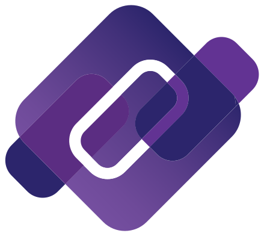
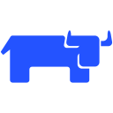
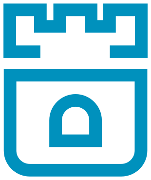
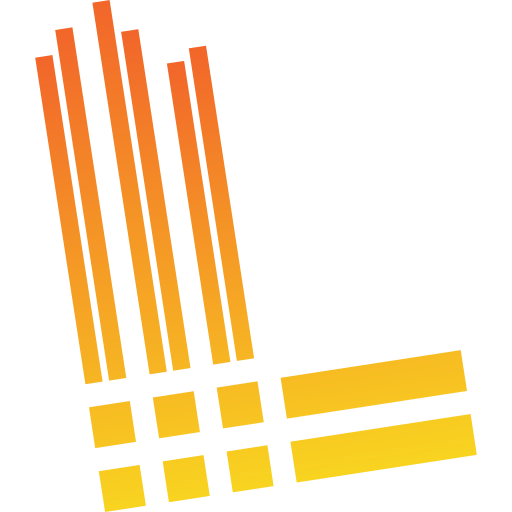
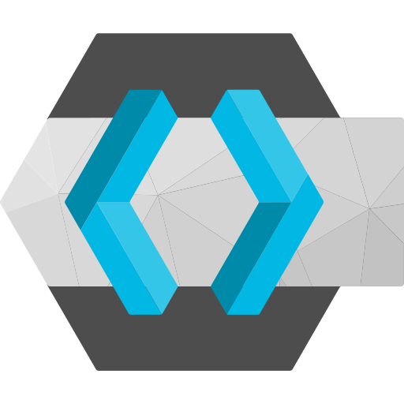
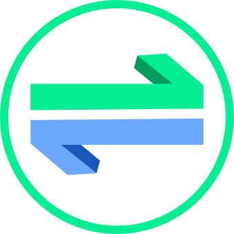

# Project Mini Kluster

### 6 Dell Optiplex Micro as a K3s Cluster
This is my own personal project to build a Kubernetes cluster at home, which is heavily based off [Riscanfre's pi-cluster project](https://github.com/ricsanfre/pi-cluster/tree/master) with a few minor variations in the technology stack and its configuration.
The philosophy of this project is to reduce reliance on 3rd party services and cloud resources, and locally host everything using open source software as much as possible.

The services in the cluster are manually managed by the Raspberry Pi via Helm and Kubectl. Although I have Ansible setup on the Raspberry Pi, I haven't gotten through learning and setting up the playbooks to automate the setup of the cluster, which I plan on doing in the future.

The cluster consists of 6 Dell Optiplex Micro for the Master/Worker nodes and a Raspberry Pi 5 as a Control node for running Ansible and Kubectl/Helm. The backup solution for the cluster is a Synology DS223 2-bay NAS running a 8TB x 2 disk RAID 0 configuration, which was gifted by my Dad.
The network switch used to connect to connect the cluster together is a Ubiquiti UniFi Switch Lite 16 port switch. Origianally the cluster was using an old TP-Link PoE 8 port network switch but I had a lot of PoE related issues with the Raspberry Pi. In the end I replaced the TP Link switch with a Ubiquiti UniFi Switch Lite 8 port, and then with the 16 port variant later on.

The cluster was originally physically located in a cardboard box in the corner of my room, but after finding the [GeekPi RackMate T2](https://deskpi.com/products/deskpi-rackmate-t2-rackmount-12u-server-cabinet-for-network-servers-audio-and-video-equipment) on sale during a Black Friday I replaced it with the cardboard box immidiately. To mount the Dell Optiplex Micros to the new server rack, I 3D printed some [Dell Optiplex Micro 10 inch rack mounts](https://www.printables.com/model/980541-dell-optiplex-7060-micropc-10-inch-rack-mount) and [Unifi 16 port PoE 10 inch rack mounts](https://www.printables.com/model/994138-ubiquiti-switch-lite-16-poe-10-inch-half-rack-moun) with my Ender3 v3 SE and Black PETG filament.

## Hosted Services
<!-- Icons from this website -->
<!-- https://dashboardicons.com -->
### On the K3s Cluster

|                                                        |  Category              | Service                     | Description |
| ---------                                              | -----------            | -----------                 | ----------- |
|                 | Kuberntes              | K3S                         | Description |
|              | Networking             | Cilium                      | Description |
|             | Networking             | CoreDNS                     | Description |
|         | Networking             | ExternalDNS                 | Description |
|               | Networking             | Istio                       | Description |
|               | Networking             | NGINX                       | Description |
|             | Management             | Rancher                     | Description |
|                | Storage                | Rook Ceph                   | Description |
|                 | Secrets/Certificates   | External Secrets Operator   | Description |
|         | Secrets/Certificates   | CertManager                 | Description |
|          | Observibility          | Prometheus                  | Description |
|             | Observibility          | Grafana                     | Description |
|           | Observibility          | Fluentbit                   | Description |
|                | Observibility          | Loki                        | Description |
|      | Observibility          | Elastic Search              | Description |
|              | Observibility          | Kibana                      | Description |
|               | Observibility          | Tempo                       | Description |
|            | Security               | Keycloak                    | Description |
|        | Security               | OAuth2-Proxy                | Description |
|        | Micro Serives          | Kafka                       | Description |
|       | Micro Serives          | CloudNativePG               | Description |
|             | Micro Serives          | MongoDB                     | Description |
|            | Micro Serives          | RabbitMQ                    | Description |
|             | CICD                   | Jenkins                     | Description |
|                                                        | Paragraph              | Text                        | Description |

### Externally hosted

|                                                        | Category               | Service                     | Description |
| -----------------                                      | -----------            | -----------                 | ----------- |
|          | Networking             | Technitium DNS              | Description |
|                | Management             | Helm                        | Description |
|     | Secrets/Certificates   | Hashicorp Vault             | Description |
|              | Storage                | RustFS                      | Running on NAS |

### Third-party

|                                                        | Category               | Service                     | Description |
| --------------------                                   | -----------            | -----------                 | ----------- |
|         | Secrets/Certificates   | Lets Encrypt                | Description |
|          | Networking             | Cloudflare                  | Description |
|              | Code Repository        | GitHub                      | Description |

### New AI Node!!
I've added an LLM inferencing node, which I made using spare PC parts and a RTX 4080 and 64GB RAM that I pulled out from my gaming system. The aim of this node is to run vLLM and llama.cpp for interencing LLM models to analyse unstructured linguistic data and run as a coding agent.

### TODO List

#### Software to setup on Cluster

- [x] Domain name
- [x] Cilium CNI
- [x] Helm on Raspberry Pi
- [x] Hashicorp vault and External Secrets Operator
- [x] Cloudflare Certbot for LetsEncrypt
- [x] CertManager
- [x] Rancher
- [x] Istio
- [x] External DNS + update credentials for DNS Server
- [x] Longhorn
- [x] SeaweedFS
- [ ] K3s Backup solution with NAS
- [ ] Node Backup solution with NAS
- [x] Replace Longhorn/SeaweedFS with Rook Ceph/RadosGW
- [x] Keycloak + Integrate OIDC with other services
- [x] Prometheus with Grafana
- [ ] Prometheus alerts + ntfy notifications
- [x] EKF Logging stack (ElasticSearch, Fluentbit, Kibana)
- [x] Fluentbit + Loki for Grafana
- [x] OpenTelemetry and Tempo
- [x] Apache Kafka on KRaft mode
- [ ] Create a single disk StorageClass with CRUSH mapping for Postgres
- [ ] Jenkins CICD
- [ ] Apache Nifi

#### Hardware setup on Cluster

- [x] 8 port switch
- [x] Geepki 12U Mini rack
- [x] 6th cluster node
- [x] HDDs for Kubernetes Storage
- [x] Replace 8 port switch with a 16 port switch
- [x] Build AI node using GPU from Gaming PC
  - [x] Install K3s
  - [x] Install CudaToolkit
  - [x] Setup vLLM + llama.cpp environment
  - [x] Create script to run Coding Agent LLM
    - [ ] Tune script for higher t/s
